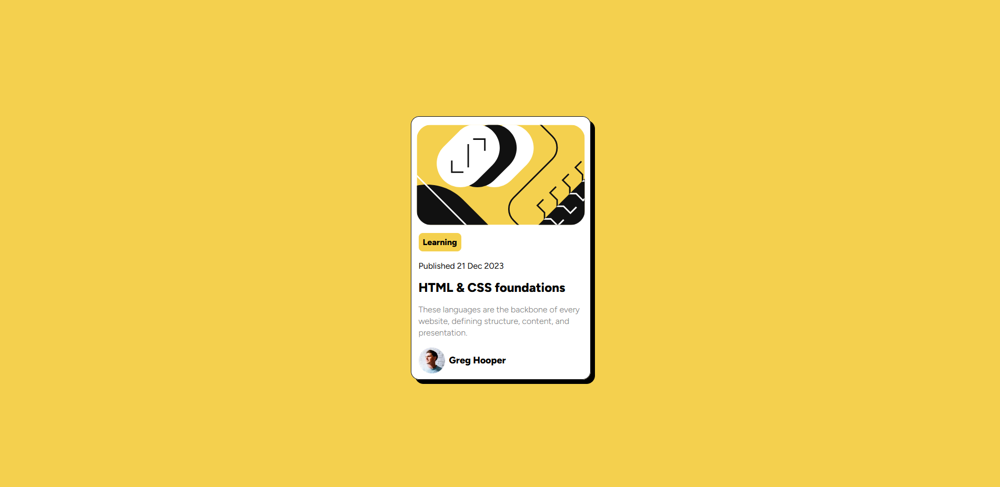

# Frontend Mentor - Blog preview card solution

This is a solution to the [Blog preview card challenge on Frontend Mentor](https://www.frontendmentor.io/challenges/blog-preview-card-ckPaj01IcS).

## Table of contents

- [Overview](#overview)
  - [The challenge](#the-challenge)
  - [Screenshot](#screenshot)
  - [Links](#links)
- [My process](#my-process)
  - [Built with](#built-with)
  - [What I learned](#what-i-learned)
  - [Continued development](#continued-development)
  - [Useful resources](#useful-resources)
- [Author](#author)
- [Acknowledgments](#acknowledgments)

## Overview

### The challenge

The Challenge is to create a blog preview element identical to the screenshot below using HTML and CSS.

### Screenshot

### Links

- Solution URL: [Add solution URL here](https://github.com/Khulekani1211/FrontEnd_Mentor/tree/386665d37bd7678bbc0943d6cf94051284044e75/blog-preview-card-main)
- Live Site URL: [Add live site URL here](https://khulekani-blog-preview-card.netlify.app/)

## My process

My process focuses on mobile first design. So I began by working on the mobile display. However, considering the fact that the blog-preview card is small enough to fit into the suggested mobile screen size of 375px, there was no need to add responsiveness through @media queries.

### Built with

- Semantic HTML5 markup
- CSS custom properties
- Flexbox
- Mobile-first workflow

### What I learned

My main take aways from this challenge has to do with centering a div correctly and how using CSS  variables for colors makes one's CSS look better and readable.

### Continued development

I plan on creating a personal blog site and this challenge has helped with an idea for how to have my blog posts previewed. A card preview instead of a simple title and description is more aesthetically appealing.

### Useful resources

- [Perfect Pixel - chrome extension](https://chromewebstore.google.com/detail/perfectpixel-by-welldonec/dkaagdgjmgdmbnecmcefdhjekcoceebi) - This helped with getting the acurate dimensions of the blog-preview card in the design.

## Author

- Website - [Khulekani](https://github.com/Khulekani1211)
- Frontend Mentor - [@yKhulekani1211](https://www.frontendmentor.io/profile/Khulekani1211)
- Twitter - [@KhulekaniGcaba](https://twitter.com/KhulekaniGcaba)

## Acknowledgments

I will like to Tip My Hat to the following FrontEnd Mentor Users, who gave me useful tips on how to improve my previous challenge, to make my HTML more semantic and improve SEO.
Thank you to @Ezekiel225, and @TorCanHack. And a special thanks to @danielmrz-dev, who brought "Perfect Pixel" chrome extension to my attention.
