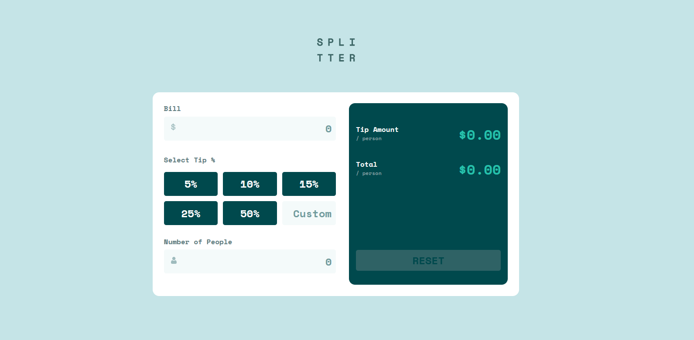

# Frontend Mentor - Tip calculator app solution

This is a solution to the [Tip calculator app challenge on Frontend Mentor](https://www.frontendmentor.io/challenges/tip-calculator-app-ugJNGbJUX). Frontend Mentor challenges help you improve your coding skills by building realistic projects.

## Table of contents

- [Overview](#overview)
  - [The challenge](#the-challenge)
  - [Screenshot](#screenshot)
  - [Links](#links)
- [My process](#my-process)
  - [Built with](#built-with)
  - [What I learned](#what-i-learned)
  - [Continued development](#continued-development)
  - [Useful resources](#useful-resources)
- [Author](#author)
- [Acknowledgments](#acknowledgments)

## Overview
The tip calculator app challenge is meant to test my ability to translate what is merely a design into a working and fully functional web app for calculating tips on a food bill.

### The challenge

Users should be able to:

- View the optimal layout for the app depending on their device's screen size
- See hover states for all interactive elements on the page
- Calculate the correct tip and total cost of the bill per person

### Screenshot



### Links

- Solution URL: [Github Code Repo](https://github.com/Khulekani1211/FrontEnd_Mentor/tree/main/tip-calculator-app-main)
- Live Site URL: [Tip Calculator App live site](https://tip-app-calculator-1.netlify.app/)

## My process

### Built with

- Semantic HTML5 markup
- CSS custom properties
- Flexbox
- CSS Grid
- Mobile-first workflow

### What I learned

The one main thing I learnt in this project was making use of data-attributes within my button elements. I have seen them used before but did not understand how and why. I used them to record the percentage values of each button.

In addition to this, making use of the forEach higher order functions has helped me toggle between having the percentage buttons active and not active.


```html
<button data-percent="5">5%</button>
```
```js
buttons.forEach(button => {
  button.addEventListener('click', () => {
    buttons.forEach(btn => btn.classList.remove('clicked'));
    
    button.classList.add('clicked');

    realTip = parseFloat(button.getAttribute('data-percent'));
    customTip.value = '';
    update();
  })
}
```

### Continued development

I really struggled with responsiveness on changing screen height. I want to continue with the project to a point where I can nail down height responsiveness.


## Author

- Frontend Mentor - [@yourusername](https://www.frontendmentor.io/profile/Khulekani1211)
- Twitter - [@yourusername](https://www.twitter.com/@KhulekaniGcaba)

